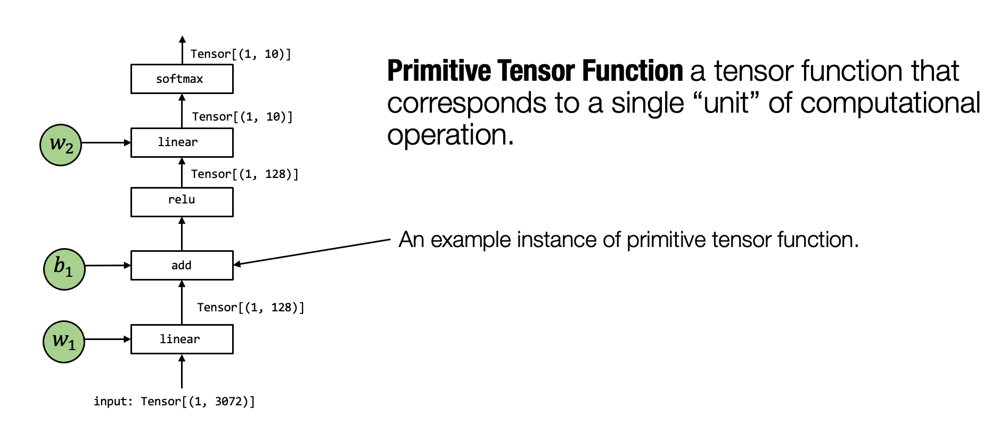
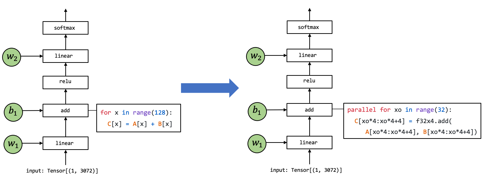
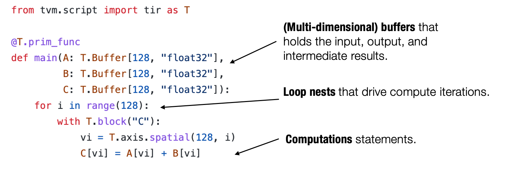

## Primitive Tensor Function

The introductory overview showed that the MLC process could be viewed as transformations among tensor functions. A typical model execution involves several computation steps that transform tensors from input to the final prediction, and each unit step is called a primitive tensor function.

:label:`fig_primitive_tensor_func`

In the above figure, the tensor operator linear, add, relu, and softmax are all primitive tensor functions. Notably, many different abstractions can represent (and implement) the same primitive tensor function add (as shown in the figure below). We can choose to call into pre-built framework libraries(e.g. torch.add or numpy.add), and leverage an implementation in python. In practice, primitive functions are implemented in low-level languages such as C/C++ with sometimes a mixture of assembly code.

:label:`fig_tensor_func_abstractions`

Many frameworks offer machine learning compilation procedures to transform primitive tensor functions into more specialized ones for the particular workload and deployment environment.

:label:`fig_tensor_func_transformation`

The above figure shows an example where the implementation of the primitive tensor function add gets transformed into a different implementation. The particular code on the right is a pseudo-code representing possible set optimizations: the loop gets split into units of length `4` where `f32x4` add corresponds to a special vector add function that carries out the computation.

## Tensor Program Abstraction

The last section talks about the need to transform primitive tensor functions. In order for us to effectively do so, we need an effective abstraction to represent the programs.

Usually, a typical abstraction for primitive tensor function implementation contains the following elements: multi-dimensional buffers, loop nests that drive the tensor computations, and finally, the compute statements themselves.

:label:`fig_tensor_func_elements`

We call this type of abstraction tensor program abstraction. One important property of tensor program abstraction is the ability to change the program through a sequence of transformations pragmatically.

:label:`fig_tensor_func_seq_transform`

For example, we should be able to use a set of transformation primitives(split, parallelize, vectorize) to take the initial loop program and transform it into the program on the right-hand side.

### Extra Structure in Tensor Program Abstraction

Importantly, we cannot perform arbitrary transformations on the program as some computations depend on the order of the loop. Luckily, most primitive tensor functions we are interested in have good properties (such as independence among loop iterations).

Tensor programs can incorporate this extra information as part of the program to facilitate program transformations.

:label:`fig_tensor_func_iteration`

For example, the above program contains the additional `T.axis.spatial` annotation, which shows that the particular variable `vi` is mapped to `i`, and all the iterations are independent. This information is not necessary to execute the particular program but comes in handy when we transform the program. In this case, we will know that we can safely parallelize or reorder loops related to `vi` as long as we visit all the index elements from `0` to `128`.

## Summary

- Primitive tensor function refers to the single unit of computation in model execution.

  - A MLC process can choose to transform implementation of primitive tensor functions.
- Tensor program is an effective abstraction to represent primitive tensor functions.
  - Key elements include: multi-dimensional buffer, loop nests, computation statement.
  - Program-based transformations can be used to optimize tensor programs.
  - Extra structure can help to provide more information to the transformations.
